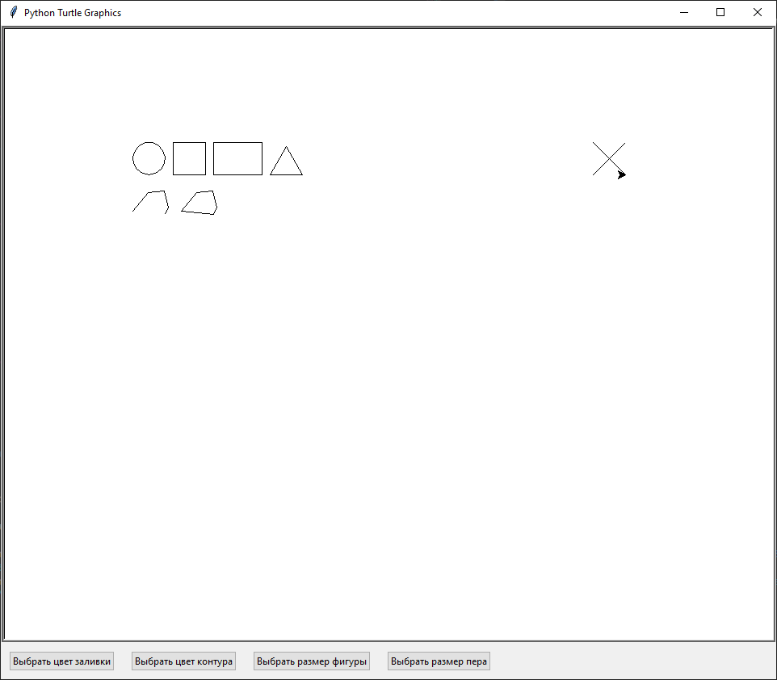

# **Painting**
## Что такое painting?
***Painting*** - это простая в использовании программа для рисования, созданная ради собственного интереса. 
## Запуск
Для функционирования программы требуется версия Python  не ниже **3.8**
## Использование
При запуске открывается следующее окно:

Сверху есть иконки **доступных фигур:** круг, квадрат, пряиоугольник, треугольник, ломаная линия, замкнутая ломаная линия и ластик *(иконка крестика)*.
Нажимая на них, мы выбираем ту фигуру, которую хотим нарисовать.

**!** Для того чтобы соединить начало и конец замкнутой ломаной, нужно нажать на ***пробел.***

Снизу же есть **доп. кнопки выбора:** цвет заливки, цвет контура, размер фигур и размер пера.
